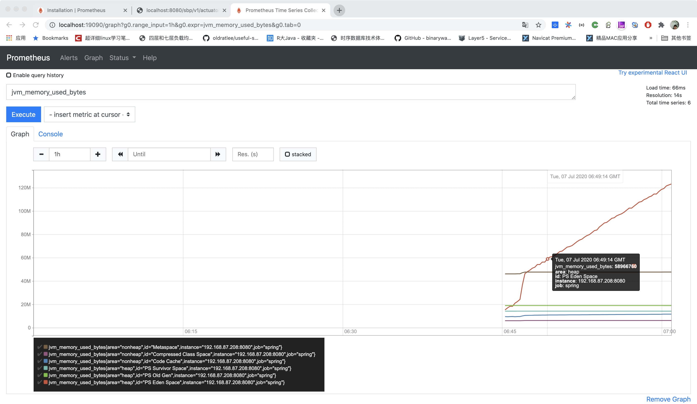
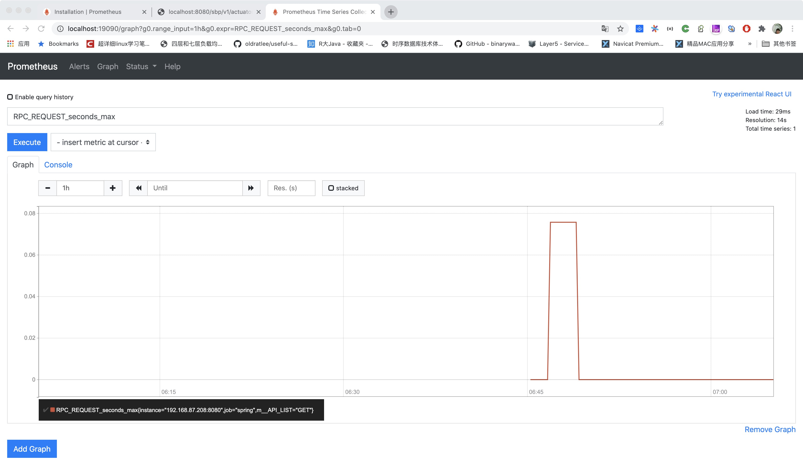
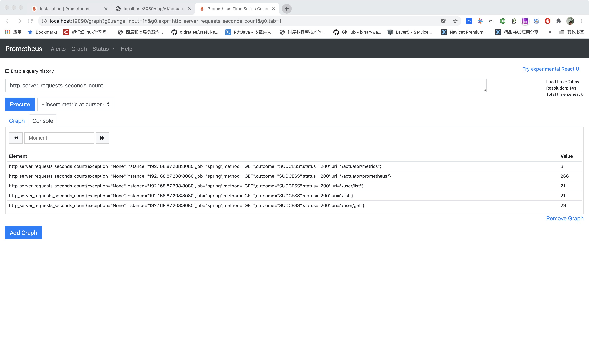

# spring-boot-prometheus
## 启动服务
- 修改 application-local.properties 配置文件，主要是数据库；或者自己指定配置文件

## 使用 Prometheus 做服务监控
- 地址：http://{ip:localhost}t:{port:8080}/sbp/v1/actuator/prometheus
- 查看指标: http://{ip:localhost}t:{port:8080}/sbp/v1/actuator/metrics

### 配置
- Maven
```$xslt
 <!-- Spring boot actuator to expose metrics endpoint -->
    <dependency>
      <groupId>org.springframework.boot</groupId>
      <artifactId>spring-boot-starter-actuator</artifactId>
    </dependency>
    <!-- Micormeter core dependecy -->
    <dependency>
      <groupId>io.micrometer</groupId>
      <artifactId>micrometer-registry-prometheus</artifactId>
      <version>${micrometer.version}</version>
    </dependency>
```
- Config
```$xslt
# 根据自己需求去查配置修改
management.endpoints.web.exposure.include=metrics,prometheus
management.endpoint.metrics.enabled=true
management.endpoint.prometheus.enabled=true
management.metrics.export.prometheus.enabled=true
```
### Prometheus是什么
- prometheus是由谷歌研发的一款开源的监控软件，目前CNCF孵化中，是继k8s托管的第二个项目，在云原生的开发中是使用最常见的监控系统，事实上的下一代监控系统

### Doc
- https://prometheus.io/docs/introduction/overview/
- https://github.com/prometheus

### 特点

1. 管理方便，部署灵活
2. 易集成，主流语言SDK可以轻松实现对Java Go Python等主流语言的程序监控
3. 存储灵活
4. 高效灵活的查询语句，满足个性化的数据需求
5. Exporter丰富能覆盖大部分主流的Server和中间件（DB Cache 等）
6. 高可用，扩展性高
7. 覆盖了监控报警和展示等功能

### 设计


### Prometheus Server
- Demo prometheus.yml
```$xslt
global:
  scrape_interval:     15s # By default, scrape targets every 15 seconds.

  # Attach these labels to any time series or alerts when communicating with
  # external systems (federation, remote storage, Alertmanager).
  external_labels:
    monitor: 'codelab-monitor'

# A scrape configuration containing exactly one endpoint to scrape:
# Here it's Prometheus itself.
scrape_configs:
  # The job name is added as a label `job=<job_name>` to any timeseries scraped from this config.
  - job_name: 'prometheus'
    # Override the global default and scrape targets from this job every 5 seconds.
    scrape_interval: 5s
    static_configs:
      - targets: ['localhost:9090']
  ## 添加我们自己的服务
  - job_name: 'spring'
    metrics_path: '/sbp/v1/actuator/prometheus'
    scrape_interval: 5s
    static_configs:
      - targets: ['192.168.87.208:8080']
```

#### 启动server
```$xslt
docker pull prom/prometheus
docker run -d \
    -p 19090:9090 \
    -v /tools/prometheus.yml:/etc/prometheus/prometheus.yml \
    prom/prometheus
```
启动后访问：http://localhost:19090/graph 就可以看到指标
- 例如查看JVM 使用

- 查看自己的指标

- 查看接口请求


### 如果需要监控Docker容器

```$xslt
docker pull google/cadvisor 

docker run \
  --volume=/:/rootfs:ro \
  --volume=/var/run:/var/run:rw \
  --volume=/sys:/sys:ro \
  --volume=/var/lib/docker/:/var/lib/docker:ro \
  --publish=28080:8080 \
  --detach=true \
  --name=cadvisor \
  google/cadvisor:latest

在prometheus.yml文件中追加
- job_name: cadvisor
  static_configs:
  - targets:
    - IP:{port:8080}

```

### 如果需要监控主机Mysql等可以找对应的Exporter
- Node: https://github.com/prometheus/node_exporter
- Mysql: https://github.com/prometheus/mysqld_exporter
- Redis: https://github.com/oliver006/redis_exporter
Other: Github上查找

## 使用Jacoco做代码覆盖率扫描
- 命令：mvn clean test org.jacoco:jacoco-maven-plugin:0.8.3:prepare-agent

## 使用H2数据库和MockTick 做单元测试
- H2数据库和mysql等有些创建表语法不一致，可使用 Test包中的Transform 工具转换表语句